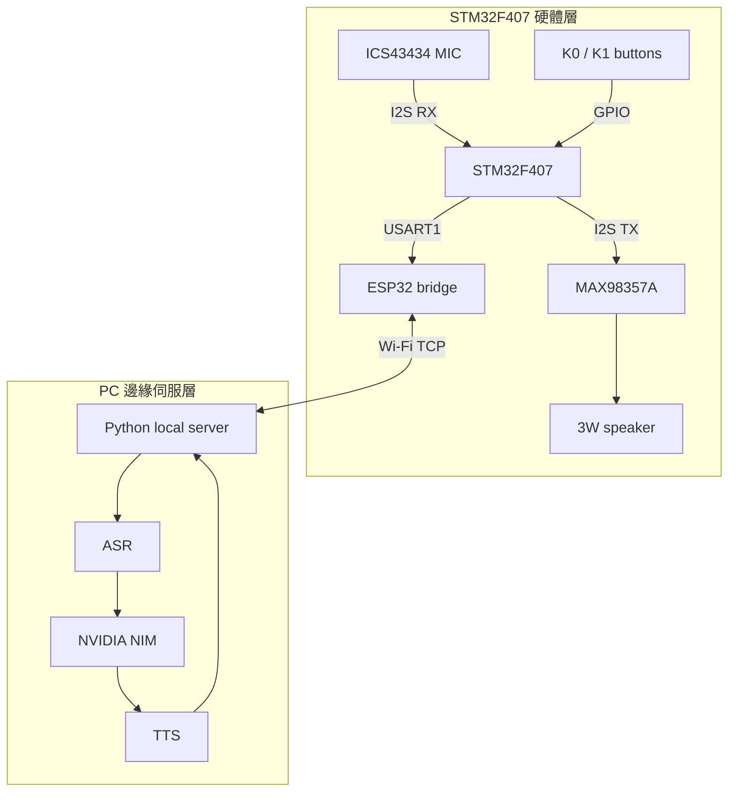

# Project NIM-Assistant | STM32 AI 語音助理

基於 STM32F407、ESP32 與 NVIDIA NIM 的邊緣語音互動專題。STM32 負責 I2S 音訊、按鍵與硬體控制；ESP32 負責 UART/Wi-Fi 橋接；PC 端負責 ASR、NIM 推論與 TTS 回傳。

## 目前狀態

- Stage 1-6 已完成：GPIO、按鍵、USART1、ESP32 PING/PONG、MAX98357A 播放、ICS43434 I2S 收音。
- Stage 7 進行中：K0 播放 Koharu login 測試語音（由 `audio_test/BA_V_Koharu_Login_1.ogg` 解碼到 `audio_test/test.wav` 後嵌入）正常；K1 record-then-playback **已可辨識語音**（錄 0.5 秒後播放）。
- 錄音路徑含 IIR low-pass filter（alpha≈1/8）、noise gate（±80）、DC removal 與 invalid sample decay。
- 目前麥克風有效資料在 left channel；雜訊仍存在但語音可辨識，後續需改 I2S DMA 進一步改善。

詳細進度請看 [progress.md](progress.md)，開發與燒錄流程請看 [process.md](process.md)。

## 系統架構

## 硬體分工

- STM32F407VET6：I2S2 full-duplex clock source、音訊取樣/播放、按鍵、狀態輸出。
- ICS43434 / INMP441 I2S microphone：目前診斷顯示 `L/R=GND` 時有效資料主要在 left channel。
- MAX98357A：I2S Class D amplifier，接收 STM32 `PB15` 的 I2S2 TX data。
- ESP32-WROOM-32E：目前用於 UART PING/PONG 測試，後續負責音訊串流到 PC。
- PC：後續承接 ASR、NVIDIA NIM、TTS 與 TCP server。

## 主要檔案

- [process.md](process.md)：專案開發流程、燒錄流程、Stage roadmap。
- [progress.md](progress.md)：目前完成度、當前 firmware 行為、下一步。
- [docs/flash_usb_dfu.md](docs/flash_usb_dfu.md)：USB DFU 燒錄與 SWD 問題整理。
- [docs/stage6_microphone_debug.md](docs/stage6_microphone_debug.md)：Stage 6 麥克風排查紀錄。
- [docs/stage7_loopback_debug.md](docs/stage7_loopback_debug.md)：Stage 7 loopback、K0/K1 測試、接線與 OVR 診斷紀錄。
- [NIM_Assistant_F407/Core/Src/main.c](NIM_Assistant_F407/Core/Src/main.c)：STM32 firmware 主程式。
- [ESP32_UART_Bridge_Test/ESP32_UART_Bridge_Test.ino](ESP32_UART_Bridge_Test/ESP32_UART_Bridge_Test.ino)：ESP32 UART bridge 測試程式。

## 快速開發流程

1. 在 STM32CubeIDE 開啟 `NIM_Assistant_F407/NIM_Assistant_F407.ioc` 或專案資料夾。
2. 按 `Ctrl+B` 編譯，產生 `NIM_Assistant_F407/Debug/NIM_Assistant_F407.elf`。
3. 進入 USB DFU：BOOT0 接 3V3，按 Reset，用 USB 線接板子自己的 USB 孔。
4. 執行 [NIM_Assistant_F407/flash_usb.bat](NIM_Assistant_F407/flash_usb.bat) 燒錄。
5. 燒錄完成後 BOOT0 接回 GND，按 Reset，從 USB CDC 或 USB-TTL 觀察 log。

## 材料與預算

| 品名 | 型號/規格 | 預估價格 |
| :--- | :--- | :--- |
| 主控核心板 | STM32F407VET6 | NT$748 |
| Wi-Fi 模組 | ESP32-WROOM-32E | NT$306 |
| 音訊模組 | ICS43434 + MAX98357A | NT$376 |
| 喇叭 | 4 ohm 3W 40mm | NT$165 |
| 顯示螢幕 | 0.96 inch OLED, SPI | NT$99 |

預估總計：約 NT$1,694，不含備品。
