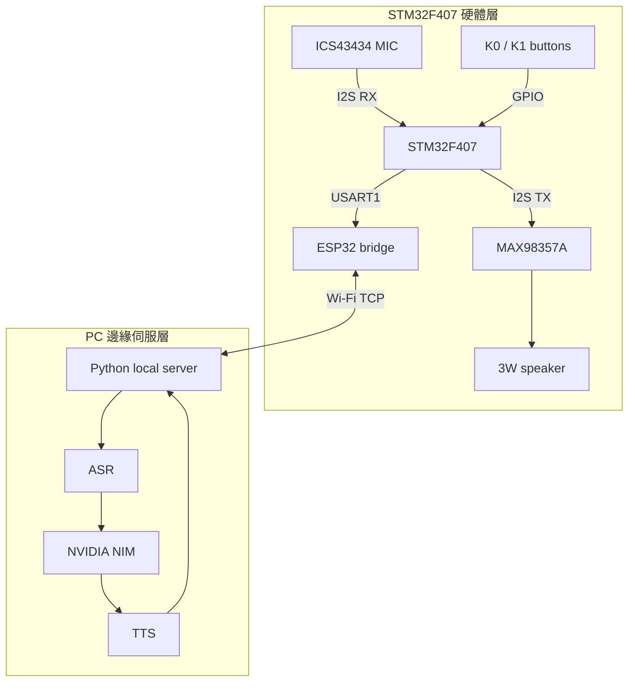

# Project NIM-Assistant | STM32 AI 語音助理

基於 STM32F407、ESP32 與 NVIDIA NIM 的邊緣語音互動專題。STM32 負責 I2S 音訊、按鍵與硬體控制；ESP32 負責 UART/Wi-Fi 橋接；PC 端負責 ASR、NIM 推論與 TTS 回傳。

## 目前狀態

- Stage 1-8 已完成：GPIO、按鍵、USART1 (921600 8N1)、ESP32 雙向通訊、MAX98357A I2S 播放、ICS43434 I2S 收音。
- Stage 8 雙向音訊串流已全鏈路打通且完成穩定化驗收：
  - **PCM1（錄音上傳）**：按住 K1 時，STM32 以 0.5 秒雙緩衝區透過 2-slot 佇列送往 ESP32，ESP32 透過**持久 TCP 連線**即時上傳 PC 並儲存成 WAV，錄音長度與按鍵時間精確對齊。
  - **AUD1（音訊播放）**：PC 端使用 **Sliding Window 流量控制 (24 KB)** 將 WAV 串流經 ESP32 送達 STM32 的 64 KB Ring Buffer。STM32 使用 USART1 RX DMA 環形緩衝與音訊未達時的淡出衰減機制，大幅消除爆音，支援長音樂流暢播放。
- 下一步是 Stage 9：PC 端 server 銜接 ASR / NVIDIA NIM / TTS，將雙向音訊傳輸轉化為完整語音助理對話環路。

詳細進度請看 [progress.md](progress.md)，開發與燒錄流程請看 [process.md](process.md)。

## 系統架構

## 硬體分工

- STM32F407VET6：I2S2 full-duplex clock source、音訊取樣/播放、按鍵、狀態輸出。
- ICS43434 / INMP441 I2S microphone：目前診斷顯示 `L/R=GND` 時有效資料主要在 left channel。
- MAX98357A：I2S Class D amplifier，接收 STM32 `PB15` 的 I2S2 TX data。
- ESP32-WROOM-32E：目前負責 USART1/Serial2 與 Wi-Fi TCP bridge，支援 `PCM1` 錄音上傳與 `AUD1` 音訊回放。
- PC：目前負責 Stage 8 TCP receiver/sender 測試；Stage 9 會接上 ASR、NVIDIA NIM、TTS 與本地 server。

## 接線總覽

以下接線整理自 Stage 7/8 的已驗證記錄，完整背景請看 [docs/stage7_loopback_debug.md](docs/stage7_loopback_debug.md) 與 [docs/stage8_audio_streaming.md](docs/stage8_audio_streaming.md)。

### I2S 音訊主幹（STM32 I2S2）

| Signal | STM32F407 pin | ICS43434 / INMP441 | MAX98357A |
| :--- | :--- | :--- | :--- |
| BCLK / SCK | `PB13` | `SCK` | `BCLK` |
| LRCLK / WS | `PB12` | `WS` | `LRC` / `WS` |
| MIC data -> STM32 | `PB14` / I2S2ext_SD | `SD` / `DOUT` | - |
| STM32 -> AMP data | `PB15` / I2S2_SD | - | `DIN` |
| GND | `GND` | `GND` | `GND` |

### 麥克風供電與選擇腳

| ICS43434 / INMP441 pin | Connect to | Note |
| :--- | :--- | :--- |
| `VDD` | STM32 `3.3V` | 只用 3.3V。 |
| `GND` | Common `GND` | 與 STM32/MAX98357A 共地。 |
| `L/R` / `SELECT` | `GND` = left、`3.3V` = right | 不能浮空。 |
| `VDD` -> `GND` | `0.1uF` capacitor | 建議靠近模組。 |
| `SD/DOUT` -> `GND` | `100kΩ` pull-down | 可選，穩定 tri-state 線路。 |

### MAX98357A 與喇叭

| MAX98357A pin | Connect to | Note |
| :--- | :--- | :--- |
| `VIN` / `VCC` | `5V` | 目前用獨立 5V。 |
| `GND` | Common `GND` | 與 STM32/MIC 共地。 |
| `SPK+` / `SPK-` | Speaker | 喇叭直接接在功放端。 |

### ESP32 UART bridge

| STM32 USART1 | ESP32 | Note |
| :--- | :--- | :--- |
| `PA9` TX | GPIO16 `RX2` | STM32 -> ESP32 |
| `PA10` RX | GPIO17 `TX2` | ESP32 -> STM32 |
| `GND` | `GND` | 共地 |

## 主要檔案

- [process.md](process.md)：專案開發流程、燒錄流程、Stage roadmap。
- [progress.md](progress.md)：目前完成度、當前 firmware 行為、下一步。
- [docs/index.md](docs/index.md)：快速索引與功能區塊導覽。
- [docs/flash_usb_dfu.md](docs/flash_usb_dfu.md)：USB DFU 燒錄與 SWD 問題整理。
- [docs/stage6_microphone_debug.md](docs/stage6_microphone_debug.md)：Stage 6 麥克風排查紀錄。
- [docs/stage7_loopback_debug.md](docs/stage7_loopback_debug.md)：Stage 7 capture/playback、K0/K1 測試、接線與 OVR 診斷紀錄。
- [docs/stage8_audio_streaming.md](docs/stage8_audio_streaming.md)：Stage 8 PCM1/AUD1、ESP32 TCP bridge、長音樂播放與穩定化紀錄。
- [NIM_Assistant_F407/Core/Src/main.c](NIM_Assistant_F407/Core/Src/main.c)：STM32 firmware 主程式。
- [ESP32_UART_Bridge_Test/ESP32_UART_Bridge_Test.ino](ESP32_UART_Bridge_Test/ESP32_UART_Bridge_Test.ino)：ESP32 UART bridge 測試程式。

## 快速開發流程

1. 在 STM32CubeIDE 開啟 `NIM_Assistant_F407/NIM_Assistant_F407.ioc` 或專案資料夾。
2. 按 `Ctrl+B` 編譯，產生 `NIM_Assistant_F407/Debug/NIM_Assistant_F407.elf`。
3. 進入 USB DFU：BOOT0 接 3V3，按 Reset，用 USB 線接板子自己的 USB 孔。
4. 執行 [NIM_Assistant_F407/flash_usb.bat](NIM_Assistant_F407/flash_usb.bat) 燒錄。
5. 燒錄完成後 BOOT0 接回 GND，按 Reset，從 USB CDC 或 USB-TTL 觀察 log。

## 目前使用的產品規格

| 品名 | 型號/規格 |
| :--- | :--- |
| 主控核心板 | STM32F407VET6 |
| Wi-Fi 模組 | ESP32-WROOM-32E |
| 音訊模組 | ICS43434 + MAX98357A |
| 喇叭 | 4 ohm 3W 40mm |
| 顯示螢幕 | 0.96 inch OLED, SPI |

