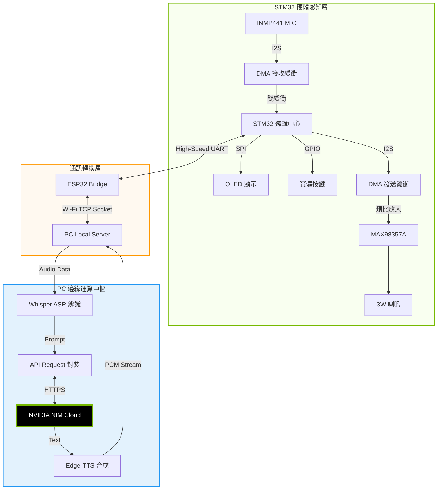
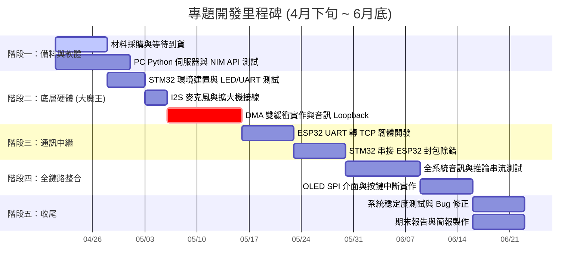

# Project NIM-Assistant | STM32 AI 語音助理

**基於 STM32 與 NVIDIA NIM 之邊緣運算語音互動助理**

## 專案簡介
本專案實踐了**「端點感知 (Edge) + 邊緣伺服 (PC) + 雲端智腦 (NIM)」**的協同運算架構。STM32 負責即時的 I2S 數位音訊擷取與硬體控制，而繁重的 AI 模型推論與語音合成則交由 PC 中繼站及 NVIDIA 雲端服務完成。這不僅大幅降低了嵌入式設備的負擔，更實現了極具人性化的智慧對話體驗。

---

## 系統全鏈路資料流圖與硬體職責

### 💻 硬體職責劃分

*   **Main Controller: STM32F407VET6**
    *   **時序管理：**精確產生 I2S 採樣所需之 Master Clock。
    *   **DMA 管理：**實作雙緩衝 (Ping-Pong Buffer) 機制，確保音訊不中斷。
    *   **資料流控制：**負責 UART 封裝與解封裝，處理與 ESP32 之間的溝通。
    *   **UI 更新：**透過 SPI 總線高速更新 OLED 對話狀態。
*   **Comms Gateway: ESP32-WROOM-32E**
    *   **網路維護：**管理 Wi-Fi 連線與容錯機制。
    *   **透明傳輸：**作為高速 UART 轉 TCP Socket 的橋接器。
    *   **加密處理：**（預留）進行基礎數據加密保護通訊。
*   **Edge Server: PC (Local Server)**
    *   **ASR 辨識：**利用電腦算力進行即時語音轉文字。
    *   **雲端串接：**整合 NVIDIA NIM 跑大型語言模型。
    *   **TTS 合成：**生成高品質人聲並串流回邊緣裝置。
*   **Audio I/O: Peripherals (Mic / Amp)**
    *   **INMP441：**提供低底噪、全向性的數位聲音輸入。
    *   **MAX98357A：**高效率 Class D 功率放大，直接驅動喇叭。

---

## 製作流程 (Production Workflow)

1.  **硬體電路組建與焊接**
    將 INMP441 麥克風與 MAX98357A 擴大機模組銲接排針，並根據 I2S 腳位定義連接至 STM32F407。確保電源供應穩定，避免音訊雜訊。
2.  **STM32 基礎音訊驅動開發**
    在 STM32CubeIDE 配置 I2S 全雙工模式，並實作 **DMA 雙緩衝 (Ping-Pong Buffer)** 邏輯。首要目標是完成「音訊回放測試」，確保收音與發聲正常。
3.  **ESP32 通訊橋接實作**
    撰寫 ESP32 程式，使其建立 Wi-Fi 連線並作為 TCP Client。開發高效的 UART 緩衝機制，將 STM32 的原始音訊流透傳至電腦端。
4.  **PC 端中繼伺服器開發 (Python)**
    使用 Python 建立 TCP Server 接收音訊。整合 **NVIDIA NIM (GLM-4.7)** 處理文字對話，並搭配 ASR/TTS 套件完成語音與文字的轉換。
5.  **系統整合與 UI 調教**
    進行全鏈路延遲測試，優化 Buffer Size。最後在 STM32 加入 OLED 顯示狀態與實體按鍵控制，完成成品製作。

---

## 開發進度排程 (Project Roadmap)

距離 6 月底完工約有 9 週時間，目前處於材料採購階段。採用「先軟後硬、分段驗收」策略以降低風險。

---

## 材料與預算清單

| 品名 | 型號/規格 | 預計價格 |
| :--- | :--- | :--- |
| 主控核心板 | STM32F407VET6 | $748 |
| Wi-Fi 模組 | ESP32-WROOM-32E (8M) | $306 |
| 音訊模組包 | INMP441 + MAX98357A | $376 |
| 喇叭單體 | 4歐姆 3W 40mm | $165 |
| 顯示螢幕 | 0.96吋 OLED (7-Pin SPI) | $99 |

**總計預算：約 NT$ 1,694 (不含備品)**

---

## 預期成果與測試策略

為降低開發風險並確保專題順利推進，本專案在軟硬體整合前，將採取**「翻譯機模式優先」**的降級測試策略，再逐步推進至**「全功能對話模式」**。

### 📌 測試階段一：中低延遲「隨身翻譯機」模式 (目前可直接用純軟體測試)
*優點：Prompt 簡單明確、無須維持對話上下文記憶，適合初期驗證通訊與音訊轉換的穩定性。*

*   **功能描述：**使用者按下按鍵說中文，系統純粹負責將其翻譯成日文（或英文），並透過 TTS 播報出來。
*   **AI Prompt 策略：**`你現在是一個專業的日文翻譯員。無論我說什麼中文，請直接翻譯成具備敬語的自然日文，不要輸出任何解釋字眼。`
*   **音訊合成方案：**選用 GPT-SoVITS (若本地算力夠強) 或 Edge-TTS 生成高還原度的外語語音。

### 📌 測試階段二：低延遲「智慧語音助理」模式 (終極目標)
*當「翻譯機模式」在 STM32 上的通訊與播放都穩定後，再切換 Prompt 進入全對話模式。*

*   **流暢對話：**按下按鍵即可與 AI (NVIDIA NIM) 進行語音對話，回應時間挑戰低於 2.5 秒。
*   **雙語能力：**支援中、日、英等多國語言翻譯與語境分析。
*   **硬體視覺化：**OLED 螢幕即時顯示音量、連線狀態與對話文字。
*   

### 原理圖

https://os-mbed-com.translate.goog/users/hudakz/code/STM32F407VET6_Hello/wiki/Homepage?_x_tr_sl=en&_x_tr_tl=zh&_x_tr_hl=zh&_x_tr_pto=sge
