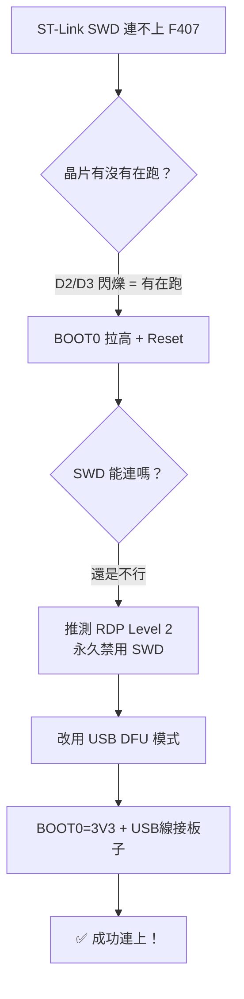

# STM32F407VET6 無法燒錄問題排查過程

## 問題描述
使用 ST-Link V2 透過 SWD 連接 STM32F407VET6 開發板時，出現 `Target no device found` / `Unable to get core ID` 錯誤，完全無法燒錄或除錯。

---

## 排查過程

### 第一步：確認電腦有抓到 ST-Link
```
ST-LINK SN  : 37FF71064E573436B44A1A43
ST-LINK FW  : V2J47S7
Voltage     : 3.30V   ← 有供電
```
✅ ST-Link 本身正常，板子有過電（3.30V）

### 第二步：確認 COM Port 狀態
掃描所有 COM Port，發現：
| Port | 來源 |
|------|------|
| COM5, COM6, COM9, COM10 | 藍牙裝置（無關） |
| COM7 | FTDI USB 轉序列，狀態 Unknown |

❌ 沒有屬於 STM32 的虛擬 COM Port

### 第三步：嘗試各種 SWD 連線模式
| 嘗試方式 | 結果 |
|----------|------|
| 標準 SWD | ❌ Unable to get core ID |
| `mode=UR` (Under Reset) | ❌ 失敗 |
| `reset=HWrst` (硬體 Reset) | ❌ 失敗 |
| `freq=100` (降低 SWD 頻率) | ❌ 失敗 |
| 交換 SWDIO / SWCLK | ❌ 失敗 |

### 第四步：觀察板子 LED 狀態（關鍵線索）
- **D1 常亮**：電源 LED → 確認板子有電
- **D2/D3 閃爍**：代表 **晶片是活的，正在執行程式！**

> [!IMPORTANT]
> 晶片沒壞！它正在跑之前燒進去的程式。問題出在 SWD 通訊層面。

### 第五步：BOOT0 拉高進入 Bootloader
1. 將 **BOOT0 接到 3V3**
2. 按下 Reset
3. **D2/D3 停止閃爍** → ✅ 確認成功進入 System Bootloader

但 SWD 還是連不上 → 排除了「程式鎖死 SWD 腳位」的可能

### 第六步：推測 RDP Level 2（根本原因）

> [!CAUTION]
> **RDP Level 2（讀保護等級 2）會永久禁用 SWD/JTAG 除錯介面。**
> 即使進入 Bootloader 模式，SWD 也完全無法使用。
> 這完美解釋了所有症狀：晶片活著、有電、Bootloader 正常，但 SWD 死活連不上。

### 第七步：改用 USB DFU 模式連線（解決方案 🎉）
F407 的 System Bootloader 除了 SWD 以外，還支援 **USB DFU** 協議。

操作方式：
1. 保持 BOOT0 = 3V3
2. 用 USB 線接上**板子自己的 USB 孔**（不是 ST-Link）
3. 按下 Reset

電腦成功偵測到：
```
STM32 Bootloader  OK   USBDevice  USB\VID_0483&PID_DF11\338A397E3035
```

透過 STM32CubeProgrammer CLI 連線成功：
```
USB speed   : Full Speed (12MBit/s)
Product ID  : STM32  BOOTLOADER
Device ID   : 0x413
Device name : STM32F405xx/F407xx/F415xx/F417xx
NVM size    : 1 MBytes
Device CPU  : Cortex-M4
```

---

## 解決方案總結



### 後續燒錄步驟
1. 在 STM32CubeIDE 編譯專案
2. 保持 BOOT0 = 3V3，USB 線接著
3. 用 STM32CubeProgrammer 選擇 **USB** 連線方式燒錄 `.elf` 或 `.bin`
4. 燒錄完成後，**BOOT0 接回 GND**，按 Reset，程式就會正常執行

> [!TIP]
> 如果需要恢復 SWD 功能，可以在 STM32CubeProgrammer 中把 RDP 從 Level 2 降回 Level 0（但這會**全部清除 Flash 資料**）。
